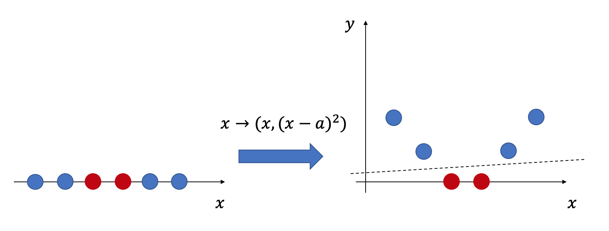
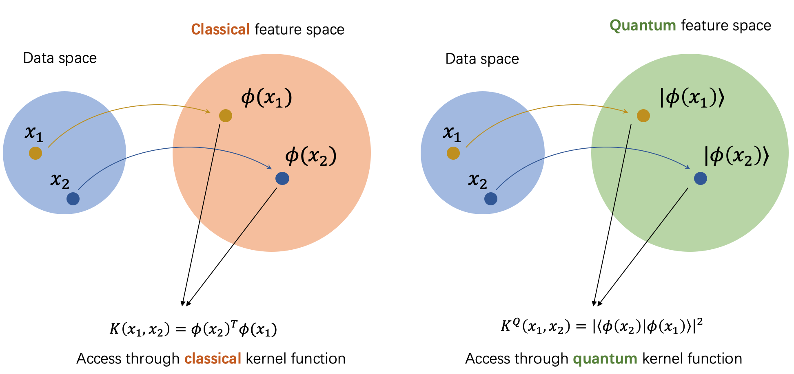

# Quantum Kernel Method

*Copyright (c) 2021 Institute for Quantum Computing, Baidu Inc. All Rights Reserved.*

> If you run this tutorial with cloud computing power, you will consume about 500 Quantum-hub points.

## Overview

Quantum kernel methods are a combination of quantum computing and kernel methods in classical machine learning, which have raised great interest and attention recently [1-7]. The basic idea of quantum kernel methods can be summarized as follows: Given a quantum computer's ability to efficiently compute the inner product of two quantum states, a quantum kernel function can gain potential advantage from the exponentially large Hilbert feature space [6-7]. In this tutorial, we will first introduce briefly the theoretical background of quantum kernel methods, and then demonstrate how to use the `KernelClassifier` module in `QAPP` to classify real data.

### Theoretical background

In classical machine learning, kernel methods' basic idea is to map low-dimensional data vectors into a potentially high-dimensional feature space via a feature map, thus allowing us to use linear methods to analyze non-linear features in the original data. As shown in Fig. 1, by mapping linearly inseparable 1D data into a 2D feature space, the feature vectors of the original data become linearly separable.



In practice, the feature space's dimensionality sometimes can be extremely large (even goes to infinity). So we do not wish to tackle these feature vectors directly. Another key idea in kernel methods is that we can implicitly analyze these feature vectors by only accessing their inner products in the feature space, which is noted as kernel functions $K(,)$:

$$
K(\mathbf{x}_i, \mathbf{x}_j) = \phi(\mathbf{x}_j)^T \phi(\mathbf{x}_i),
\tag{1}
$$

with $\phi()$ being the feature map. We note that in kernel methods, we do not need to express the feature map explicitly. Instead, we only need to compute the kernel function. This approach can introduce non-linearity into our models, giving us the ability to recognize intractable patterns in the original data space.   

The arguably most famous application of kernel methods is a support vector machine (SVM), which solves linear classification problems. Take a 2-classification problem as an example: Given a data set $T = \{ (\mathbf{x}_1, y_1), ..., (\mathbf{x}_m, y_m) \} \subset \mathcal{X}\times\mathbb{Z}_2$, with a hyperplane $( \mathbf{w}, b)$, a support vector machine can assign labels according to the signs of the decision function, as:

$$
y_{\rm pred} = {\rm sign}(\langle \mathbf{w}, \mathbf{x} \rangle + b).
\tag{2}
$$

But for linearly inseparable data, such linear classification schemes do not work. So in this case, as shown in Fig. 1, we can potentially find a better separation by mapping them into a feature space. For example, if we note the separating hyperplane in the feature space as $(\mathbf{w}', b')$, then the decision function becomes:

$$
y_{\rm pred} = {\rm sign}(\langle \mathbf{w}', \phi(\mathbf{x}) \rangle + b').
\tag{3}
$$

Furthermore, by duality, we can write the hyperplane as $\mathbf{w}' = \sum_i \alpha_i \phi(\mathbf{x_i})$ with Lagrangian multipliers $\alpha_i$ [8]. Then, under the constraints $\alpha_i \geq 0$ and $\sum_i y_i \alpha_i=0$, we can compute the optimal $\alpha_i^*$, thus the optimal hyperplane by maximizing 

$$
\sum_i \alpha_i - \frac{1}{2} \sum_{i, j} \alpha_i \alpha_j y_i y_j \phi(\mathbf{x}_j)^T \phi(\mathbf{x}_i).
\tag{4}
$$

Notice that in Eq. (4), we only need the inner products of feature vectors $\phi(\mathbf{x}_j)^T \phi(\mathbf{x}_i) = K(x_i, x_j)$, which is the kernel function mentioned above. As a result, we are able to find the optimal separating hyperplane in the feature space with SVM by only accessing the feature space through the kernel function. Furthermore, we can compute the predicted label as follows:

$$
y_{\rm pred} = {\rm sign}(\sum_i \alpha^*_i  \langle \phi(\mathbf{x_i}), \phi(\mathbf{x}' \rangle + b') = 
{\rm sign}(\sum_i \alpha^*_i  K(\mathbf{x}_i, \mathbf{x}') + b').
\tag{5}
$$

Again, only kernel function is needed. 

Given the idea of classical kernel methods, we can easily understand the essential idea of quantum kernel methods. First, consider a quantum feature space, where we map a classical data vector $\mathbf{x}$ into a quantum state $| \phi(\mathbf{x})\rangle$ by an encoding circuit $U(\mathbf{x})$ as follows:

$$
U(\mathbf{x}) | 0^{\otimes N} \rangle = | \phi(\mathbf{x}) \rangle.
\tag{6}
$$

There are many discussions about how to best design an encoding circuit. We refer to our [data encoding tutorial](https://qml.baidu.com/tutorials/machine-learning/encoding-classical-data-into-quantum-states.html) provided by Paddle Quantum for more details. The encoding can also be regarded as a quantum feature map from classical data space to the Hilbert space. Based on this idea, we define a quantum kernel function as the inner products of two quantum feature vectors in the Hilbert space, which is

$$
K^Q_{ij} = |\langle \phi(\mathbf{x}_j) | \phi(\mathbf{x}_i) \rangle |^2,
\tag{7}
$$

which can be further formulated as

$$
|\langle \phi(\mathbf{x}_j) | \phi(\mathbf{x}_i) \rangle |^2 =  |\langle 0^{\otimes N} | U^\dagger(\mathbf{x}_j) U(\mathbf{x}_i) | 0^{\otimes N} \rangle |^2.
\tag{8}
$$

By running the quantum circuit as shown in Fig. 2, and measuring the probability of observing $| 0^{\otimes N} \rangle $ at the output, we can estimate the quantum kernel function in Eq. (8). This way of constructing quantum kernels is also known as quantum kernel estimation (QKE). By replacing the classical kernel function in Eq. (4-5) with QKE, we can classify data in the quantum feature space with SVM. Given the potentially non-simulatable nature of such quantum kernels, there might exist a quantum advantage in recognizing classically intractable patterns. Such an advantage has been rigorously shown, with a constructed classically hard classification problem and a carefully designed quantum feature map [3].




## Classify MNIST data with Quantum Kernel Methods

Now, let's use the hand written digits (MNIST) data as an example to demonstrate how to classify data with QCompute and QAPP.


First we import relevant packages from `QAPP`, `QCompute`, and `skimage` (please ensure that the above packages are correctly installed in your current environment).

```python
import numpy as np
import time
import json
from skimage.transform import resize
from qcompute_qapp.algorithm.kernel_classifier import KernelClassifier
from QCompute import Define
from QCompute.QPlatform import BackendName
```

The built-in `KernelClassifier` provides an easy-to-use implementation of the aforementioned quantum kernel method. In this example, we use a local simulator `LocalBaiduSim2` as the backend. Users may find more backends on the Quantum-hub website. Specifically, users can choose a real quantum processing unit (QPU) as the backend by setting the backend to `CloudIoPCAS`.

```python
backend = BackendName.LocalBaiduSim2
# Readers should get their tokens from quantum-hub.baidu.com to be connected to real quantum devices and cloud backend.
# from QCompute import Define
# Define.hubToken = 'your token'
# backend = BackendName.CloudIoPCAS # Real quantum computer
# backend = BackendName.CloudBaiduSim2Water # Cloud backend
myKernelClassifier = KernelClassifier(backend=backend)
```

We have prepared some MNIST hand-written digits data locally in a `.json` format. Readers could load them directly.

```python
print('Loading local MNIST data...')
fp = open('./data/MNIST_data.json', 'rt+')
mnist = json.load(fp)
fp.close()
```

The original size of the MNIST image data is 28 x 28=784. To encode such data with limited number of qubits，we must reduce the dimension of the original data by down-sampling. Here we define a utility function `get_data()`, which generates binary classification data with reduced dimensionality based on the original MNIST data.

```python
# Generate a new dataset containing data from two classes from the MNIST hand-written digit dataset
def get_data(first_num=1,
             second_num=8,
             data_size=10,
             scale=2):
    # Pick two labels from [1, ..., 10] to make the bi-classification problem
    data_first_num = mnist['data'][mnist['target'] == str(first_num)]
    data_second_num = mnist['data'][mnist['target'] == str(second_num)]
    data_unsampled = np.vstack([data_first_num, data_second_num])
    label_unsampled = np.hstack([np.zeros(len(data_first_num)), np.ones(len(data_second_num))])

    # Randomly pick n=data_size samples as the new dataset
    idx = np.random.randint(low=0, high=len(label_unsampled), size=data_size)
    data_uncompressed = data_unsampled[idx]
    label = label_unsampled[idx]

    # Down-sample the data to the size of scale x scale
    data_unnormalized = [resize(image.reshape([28, 28]), [scale, scale]).flatten() for image in data_uncompressed]

    # Renormalize the data
    data = [(image / image.max()) * np.pi for image in data_unnormalized]

    return np.array(data), label
```

Then, use the utility function to generate both the training and testing data.

```python
data_train, label_train = get_data(data_size=18, scale=3)
data_test, label_test = get_data(data_size=10, scale=3)
```

By using `KernelClassifier.fit()` and `KernelClassifier.predict()`，we can train the quantum kernel classifier and then make predictions for the testing data.

```python
# Train the classifier with the training data
myKernelClassifier.fit(data_train, label_train)

# Predict the label for the testing data
predict_svm_qke_test = myKernelClassifier.predict(data_test)
```

Lastly, we compute the error rate on the testing set.

```python
error_rate = sum(abs(predict_svm_qke_test - label_test)) / len(predict_svm_qke_test)
print('Testing Error Rate:', error_rate)
```

```
Testing Error Rate: 0.1
```

Now, the classification task is completed. In this example, we have down-sampled the original 28 x 28 data to 3 x 3 pixels, yet the quantum kernel classifier still performs very well. We have reasons to believe that with increasing number of available qubits on a real quantum device, the performance of quantum kernel methods can be further improved. Furthermore, we also encourage readers to do experiments with more diverse data and dimension reduction means with quantum kernel classifier.

---

## References

[1] Schuld, Maria. "Supervised quantum machine learning models are kernel methods." arXiv preprint [arXiv:2101.11020 (2021)](https://arxiv.org/abs/2101.11020).

[2] Havlíček, Vojtěch, et al. "Supervised learning with quantum-enhanced feature spaces." [Nature 567.7747 (2019): 209-212](https://arxiv.org/abs/1804.11326).

[3] Huang, Hsin-Yuan, et al. "Power of data in quantum machine learning." arXiv preprint [arXiv:2011.01938 (2020)](https://arxiv.org/abs/2011.01938).

[4] Schuld, Maria, and Nathan Killoran. "Quantum machine learning in feature Hilbert spaces." [Phys. Rev. Lett. 122.4 (2019): 040504](https://arxiv.org/abs/1803.07128).

[5] Hubregtsen, Thomas, et al. "Training Quantum Embedding Kernels on Near-Term Quantum Computers." arXiv preprint [arXiv:2105.02276(2021)](https://arxiv.org/abs/2105.02276).

[6] Glick, Jennifer R., et al. "Covariant quantum kernels for data with group structure." arXiv preprint [arXiv:2105.03406(2021)](https://arxiv.org/abs/2105.03406).

[7] Liu, Yunchao, Srinivasan Arunachalam, and Kristan Temme. "A rigorous and robust quantum speed-up in supervised machine learning." arXiv preprint [arXiv:2010.02174 (2020)](https://arxiv.org/abs/2010.02174).

[8] Schölkopf, Bernhard, and Alexander J. Smola"Learning with kernels: support vector machines, regularization, optimization, and beyond." [MIT Press(2002)](https://mitpress.mit.edu/books/learning-kernels).
