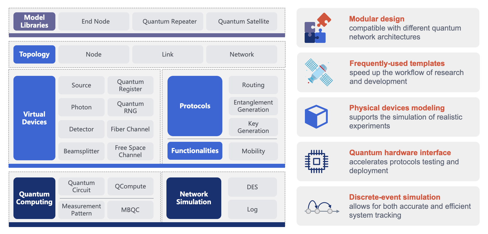

# Introduction

*Copyright (c) 2022 Institute for Quantum Computing, Baidu Inc. All Rights Reserved.*

## About QNET

QNET is a Quantum NETwork toolkit developed by the [Institute for Quantum Computing](https://quantum.baidu.com) at [Baidu Research](http://research.baidu.com/). It aims to accelerate the design of quantum network protocols, the testing of quantum network architectures and the deployment of quantum internet standards. QNET provides a fully-featured discrete-event simulation framework that allows for both accurate and efficient tracking of quantum network status. Its modular design provides a testbed for different quantum network architectures.



## Features

QNET is under active development and the latest version has the following key features:
* discrete-event simulation framework that allows for both accurate and efficient system tracking;
* quantum hardware interface that accelerates protocols testing and deployment;
* physical devices modeling that supports the simulation of realistic experiments;
* frequently-used templates that speed up the workflow of research and development;
* modular design that is compatible with different quantum network architectures.


## Tutorials

We provide several tutorials to help users get started with QNET. These include:
* Introduction to discrete-event simulation
* Tour guide to quantum network simulation
* Micius quantum satellite experiment
* Quantum network architecture simulation
* Quantum network architecture with resource management
* Quantum network protocols on quantum hardware devices
* Quantum teleportation
* Quantum entanglement swapping
* CHSH game
* Magic square game
* Measurement-based quantum computation
* Dynamic quantum circuit

More tutorials and demonstrations will be included in the future release.


## Feedbacks

Users are encouraged to contact us via email quantum@baidu.com with general questions, unfixed bugs, and potential improvements. We hope to make QNET better together with the community!


## Research based on QNET

We also encourage researchers and developers to use QNET to explore quantum networks. If your work uses QNET, feel free to send us a notice via quantum@baidu.com and cite us with the following BibTeX:
```latex
@misc{QNET,
      title = {{Quantum NETwork in Baidu Quantum Platform}},
      year = {2022},
      url = {https://quantum-hub.baidu.com/qnet/}
}
```


## Copyright and License

QNET uses [Apache-2.0 license](https://github.com/baidu/QCompute/blob/master/LICENSE).

