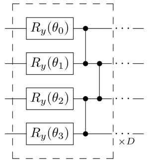

# Variational Quantum Eigensolver

*Copyright (c) 2021 Institute for Quantum Computing, Baidu Inc. All Rights Reserved.*

> If you run this tutorial with cloud computing power, you will consume about 300 Quantum-hub points.

## Overview

It is widely believed that one of the most promising applications of quantum computing in the near future is solving quantum chemistry problems [1-2]. **Variational Quantum Eigensolver** (VQE) is a strong proof to this possibility of studying quantum chemistry with **Noisy Intermediate-Scale Quantum** (NISQ) devices [1-4]. The core task is to solve the ground state of any molecular Hamiltonian $\hat{H}$ by preparing a parametrized wave function ansatz $|\Psi(\boldsymbol\theta)\rangle$ on a quantum computer and adopt classical optimization methods (e.g. gradient descent) to adjust the parameters $\boldsymbol\theta$ to minimize the expectation value $\langle \Psi(\boldsymbol\theta)|\hat{H}|\Psi(\boldsymbol\theta)\rangle$. This approach is based on the **Rayleigh-Ritz variational principle**. 

$$
E_0 = \min_{\boldsymbol\theta} \langle \Psi(\boldsymbol\theta)|\hat{H}|\Psi(\boldsymbol\theta)\rangle.
\tag{1}
$$

where $E_0$ denotes the ground state energy. Numerically, it can be understood as finding the smallest eigenvalue $\lambda_{\min}$ of a **discretized** Hamiltonian $H$ (hermitian matrix) and its corresponding eigenvector $|\Psi_0\rangle$. How such a discretization can be done on a classical computer belongs to the art of quantum chemistry and is far beyond the scope of this tutorial. In general, such a Hamiltonian $H$ is expressed as a weighted sum of Pauli spin operators $\{X,Y,Z\}$ (native to quantum devices) such that this information can be processed on a quantum computer.

$$
H = \sum_k c_k ~ \bigg( \bigotimes_{j=0}^{M-1} \sigma_j^{(k)} \bigg),
\tag{2}
$$

where $\sigma_j^{(k)} \in \{I,X,Y,Z\}$ and $M$ stands for qubit number. We refer this form of Hamiltonian as **Pauli strings**. For example, 

$$
H= 0.12~Y_0 \otimes I_1-0.04~X_0\otimes Z_1.
\tag{3}
$$

Now we will show how to use QCompute and QAPP to estimate the ground state energy of LiH (lithium hydride) molecule.

## Ground state energy of LiH molecule

First of all, let us import the necessary libraries and packages.

```python
import numpy as np
from QCompute import Define
from QCompute.QPlatform import BackendName
from qcompute_qapp.application.chemistry import LiH_HAMILTONIAN, MolecularGroundStateEnergy
from qcompute_qapp.algorithm import VQE
from qcompute_qapp.circuit import RealEntangledCircuit
from qcompute_qapp.optimizer import SMO
```

We provide some Hamiltonians encoding ground states of common molecules, including LiH.

```python
lih = MolecularGroundStateEnergy(num_qubits=LiH_HAMILTONIAN[0], hamiltonian=LiH_HAMILTONIAN[1])
```

### Building QNN and trial wave function

To implement VQE, we firstly need to design a quantum neural network QNN to prepare the wave function ansatz $|\Psi(\boldsymbol\theta)\rangle$. Here, we provide a 4-qubit quantum circuit template with a depth of $D$ blocks. The dotted frame in the figure below denotes a single block:



Next, we use the `RealEntangledCircuit` class in QAPP to realize this QNN.

```python
DEPTH = 1
iteration = 3
# Initialize ansatz parameters
parameters = 2 * np.pi * np.random.rand(lih.num_qubits * DEPTH) - np.pi
ansatz = RealEntangledCircuit(lih.num_qubits, DEPTH, parameters)
```

### Training

After constructing the QNN, we can proceed to the training part. But first, we need to choose the optimization method for training. Here we use Sequential Minimal Optimization [5], which is provided in QAPP as the `SMO` class.

```python
# Initialize an optimizer
opt = SMO(iteration, ansatz)
# Choose a Pauli measurement method
measurement = 'SimMeasure'
```

Use the VQE algorithm provided in QAPP, we can easily estimate the ground state energy of LiH. By default, we use the local simulator `LocalBaiduSim2` provided by QCompute as the backend to run quantum circuits. Users may find more backends on the Quantum-hub website. Specially, users can choose a real quantum device as the backend by setting the backend to `CloudIoPCAS`.

```python
# Fill in your Quantum-hub token if using cloud resources
Define.hubToken = ""
backend = BackendName.LocalBaiduSim2
# Uncomment the line below to use a cloud simulator
# backend = BackendName.CloudBaiduSim2Water
# Uncomment the line below to use a real quantum device
# backend = BackendName.CloudIoPCAS
vqe = VQE(lih.num_qubits, lih.hamiltonian, ansatz, opt, backend, measurement=measurement)
vqe.run(shots=4096)
print("estimated ground state energy: {} Hartree".format(vqe.minimum_eigenvalue))
print("theoretical ground state energy: {} Hartree".format(lih.compute_ground_state_energy()))
```

```
estimated ground state energy: -7.863157194497863 Hartree
theoretical ground state energy: -7.863353035768483 Hartree
```

---

## References

[1] Cao, Yudong, et al. "Quantum chemistry in the age of quantum computing." [Chemical Reviews 119.19 (2019): 10856-10915](https://pubs.acs.org/doi/10.1021/acs.chemrev.8b00803).

[2] McArdle, Sam, et al. "Quantum computational chemistry." [Reviews of Modern Physics 92.1 (2020): 015003](https://journals.aps.org/rmp/abstract/10.1103/RevModPhys.92.015003).

[3] Peruzzo, Alberto, et al. "A variational eigenvalue solver on a photonic quantum processor." [Nature Communications 5.1 (2014): 1-7](https://www.nature.com/articles/ncomms5213).

[4] Moll, Nikolaj, et al. "Quantum optimization using variational algorithms on near-term quantum devices." [Quantum Science and Technology 3.3 (2018): 030503](https://iopscience.iop.org/article/10.1088/2058-9565/aab822).

[5] Nakanishi, Ken M., Keisuke Fujii, and Synge Todo. "Sequential minimal optimization for quantum-classical hybrid algorithms." [Physical Review Research 2.4 (2020): 043158](https://journals.aps.org/prresearch/abstract/10.1103/PhysRevResearch.2.043158).
